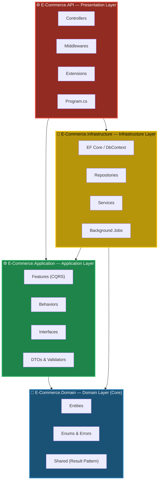

<p align="center">
  
</p>

<h1 align="center">E-Commerce API</h1>

<p align="center">
  <strong>A production-ready, enterprise-grade RESTful API for modern e-commerce platforms</strong><br/>
  <em>Built with Clean Architecture · CQRS · Domain-Driven Design · .NET 10</em>
</p>

<p align="center">
  <a href="https://dotnet.microsoft.com/"></a>
  <a href="https://github.com/ahmed-hamada-hassan/E-Commerce"></a>
  <a href="https://github.com/ahmed-hamada-hassan/E-Commerce/stargazers"></a>
  <a href="https://github.com/ahmed-hamada-hassan/E-Commerce/commits/main"></a>
</p>

<br/>

<p align="center">
  <a href="http://my-ecommerce.runasp.net"><strong>🌐 Live API</strong></a> &nbsp;·&nbsp;
  <a href="http://my-ecommerce.runasp.net/scalar/"><strong>📖 Interactive Docs (Scalar)</strong></a> &nbsp;·&nbsp;
  <a href="#-getting-started"><strong>🚀 Quick Start</strong></a>
</p>

<br/>

---

<br/>

## 📖 About

**E-Commerce API** is a full-featured, enterprise-grade backend system powering modern e-commerce operations — from user registration and multi-vendor product management to order processing, payments, returns, and feedback moderation. The system is designed following **Clean Architecture** principles with **CQRS** via MediatR, ensuring strict separation of concerns, testability, and maintainability at scale.

### Architecture at a Glance

| Concern | Implementation |
|:--------|:---------------|
| Monolithic codebases become unmanageable | **Clean Architecture** with strict layer separation and inward-only dependencies |
| Business logic leaks into controllers | **CQRS + MediatR** encapsulates every use case into isolated command/query handlers |
| Validation scattered across layers | **FluentValidation** pipeline behavior enforces rules before handlers execute |
| Hard-coded DI registrations grow endlessly | **Scrutor** auto-scans and registers services by marker-interface convention |
| No audit trail for deleted data | **Soft-delete EF Core interceptor** preserves records with `IsDeleted` flags |
| Unstructured logging makes debugging hard | **Serilog** with structured, async file + console sinks |
| API abuse and brute-force attacks | **14-policy rate limiting** engine with IP, user, and role-based partitioning |

<br/>

---

<br/>

## 🏗️ Tech Stack

<table align="center">
  <tr>
    <td align="center" width="140">
      
    </td>
    <td align="center" width="140">
      
    </td>
    <td align="center" width="140">
      
    </td>
    <td align="center" width="140">
      
    </td>
  </tr>
  <tr>
    <td align="center" width="140">
      
    </td>
    <td align="center" width="140">
      
    </td>
    <td align="center" width="140">
      
    </td>
    <td align="center" width="140">
      
    </td>
  </tr>
  <tr>
    <td align="center" width="140">
      
    </td>
    <td align="center" width="140">
      
    </td>
    <td align="center" width="140">
      
    </td>
    <td align="center" width="140">
      
    </td>
  </tr>
</table>

<br/>

| Component | Role |
|:----------|:-----|
| **SQL Server** | Primary relational database for all domain entities |
| **Redis** | Distributed caching layer for performance optimization |
| **Cloudinary** | Cloud-based image storage for product images and user avatars |
| **Scalar** | Interactive OpenAPI documentation and API explorer |

<br/>

---

<br/>

## 🏛️ Clean Architecture

This project strictly follows **Clean Architecture** (also known as Onion Architecture), where dependencies point **inward only**. The inner layers have zero knowledge of outer layers — all cross-layer communication is through abstractions defined in the Application layer.



> **The Dependency Rule:** Source code dependencies always point inward. Domain has no dependencies. Application depends only on Domain. Infrastructure implements Application interfaces. API orchestrates everything at the composition root.

<br/>

### 📂 Project Structure

```
E-Commerce/
│
├── 📁 E-Commerce.API/                      ← Presentation Layer
│   ├── 📁 Controllers/                     19 controllers with role-based routing
│   │   ├── BaseApiController.cs            CurrentUserId & CurrentVendorId helpers
│   │   ├── AuthController.cs               Register (customer/vendor/admin) & login
│   │   ├── ProductsController.cs           Public product browsing & batch retrieval
│   │   ├── CartController.cs               Shopping cart + Buy-Now instant checkout
│   │   ├── OrdersController.cs             Place, cancel, return orders
│   │   ├── WishlistController.cs           Wishlist management
│   │   ├── VendorProductsController.cs     Full product + image CRUD
│   │   ├── RepresentativeOrderController   Return request processing
│   │   └── Admin*Controller.cs             Admin management endpoints
│   ├── 📁 Extensions/                      Rate limiting, mapping extensions
│   ├── 📁 Middlewares/                     Global exception handler
│   └── Program.cs                          Composition root & DI configuration
│
├── 📁 E-Commerce.Application/              ← Application Layer (Use Cases)
│   ├── 📁 Behaviors/                       MediatR pipeline behaviors
│   │   ├── LoggingBehavior.cs              Request/response logging
│   │   └── ValidateBehavior.cs             FluentValidation enforcement
│   ├── 📁 Common/                          Settings (JWT, Cloudinary, Redis, Pagination)
│   ├── 📁 Features/                        CQRS feature slices
│   │   ├── 📁 Auth/                        Login, Register, Refresh Token
│   │   ├── 📁 Products/                    CRUD, Archive, Suspend, Restore
│   │   ├── 📁 Orders/                      Place, Cancel, Ship, Return, Refund
│   │   ├── 📁 Carts/                       Add, Remove, Update, Buy-Now
│   │   ├── 📁 Categories/                  CRUD with soft-delete & restore
│   │   ├── 📁 ProductImages/               Upload, Reorder, Replace, Set Primary
│   │   ├── 📁 Users/                       Block, Unblock, Delete, Update
│   │   ├── 📁 Vendors/                     Activate, Deactivate, Update
│   │   ├── 📁 Feedbacks/                   Create, Edit, Delete, Approve
│   │   ├── 📁 Wishlists/                   Add, Remove, Get
│   │   └── 📁 Addresses/                   CRUD + Set Default Shipping
│   └── 📁 Interfaces/                      Repository & service abstractions
│
├── 📁 E-Commerce.Infrastructure/            ← Infrastructure Layer
│   ├── 📁 BackgroundJobs/                  Automated order & product processing
│   ├── 📁 Data/
│   │   ├── AppDbContext.cs                 EF Core context with soft-delete filters
│   │   ├── DbInitializer.cs               Seed roles, users, and test data
│   │   ├── 📁 Configs/                    16 entity type configurations
│   │   ├── 📁 Interceptors/              SoftDeleteInterceptor
│   │   └── 📁 Repositories/              11 repository implementations
│   ├── 📁 Migrations/                     EF Core database migrations
│   └── 📁 Services/                       Token, Cloudinary, Payment, UserContext
│
├── 📁 E-Commerce.Domain/                   ← Domain Layer (Core)
│   ├── 📁 Entities/                       17 rich domain entities
│   ├── 📁 Enums/                          OrderStatus, PaymentMethod, etc.
│   ├── 📁 Errors/                         17 domain-specific error classes
│   ├── 📁 Shared/                         Result<T>, AppRoles, Pagination
│   └── 📁 Common/                         ISoftDeletable, SoftDeletable base
│
└── E-Commerce.slnx                         Solution file
```

<br/>

---

<br/>

## ✨ Key Features

<table>
  <tr>
    <td>

### 🔐 Authentication & Authorization
- JWT Bearer authentication with refresh token rotation
- Role-based access control: **SuperAdmin**, **Admin**, **Vendor**, **Customer**, **Representative**
- Account lockout protection (5 attempts → 10-min lock)
- Configurable password complexity policies

### 📦 Product Management
- Full CRUD with soft-delete and restore capabilities
- Multi-image upload, reorder, and set-primary via Cloudinary
- Vendor-scoped product catalogs with admin oversight
- SKU uniqueness validation
- Background cleanup jobs for orphaned products
- Batch product retrieval by IDs

### 🛒 Cart & Checkout
- Shopping cart with real-time stock validation
- **Buy-Now** — instant single-product checkout flow
- Guest cart support via `X-Cart-Id` header
- Automatic cart cleanup on order placement

</td>
    <td>

### 📋 Orders & Returns
- Multi-status lifecycle: Processing → Shipped → Delivered
- Order cancellation with automatic stock restoration
- Return request workflow with admin approval
- Representative-driven return completion
- Background service for auto-cancelling stale orders

### 💳 Payments & Refunds
- Extensible payment factory pattern
- Cash-on-delivery implementation
- Automated refund processing pipeline
- Payment status tracking per order

### ⭐ Reviews & Wishlists
- Product review system with admin moderation queue
- Feedback approval pipeline before public display
- Personal wishlist with duplicate prevention
- Customer feedback CRUD operations

</td>
  </tr>
</table>

<br/>

---

<br/>

## 🛡️ Rate Limiting Engine

The API implements a **comprehensive, multi-policy rate limiting system** using ASP.NET Core's built-in `RateLimiter` middleware. Each policy is tailored to its specific use case with appropriate limiter algorithms, partition keys, and thresholds.

| Policy | Algorithm | Limit | Window | Partition Key |
|:-------|:----------|:-----:|:------:|:--------------|
| `Login` | Sliding Window | 6 req | 1 min | Remote IP |
| `Signup` | Sliding Window | 3 req | 1 hour | Remote IP |
| `AdminSignup` | Fixed Window | 10 req | 1 hour | Admin User ID |
| `RefreshToken` | Fixed Window | 5 req | 1 min | Remote IP |
| `UserActions` | Fixed Window | 15 req | 1 min | User ID ∥ IP fallback |
| `AdminManagement` | Fixed Window | 60 req | 1 min | Admin ID ∥ IP fallback |
| `GuestCartActions` | Token Bucket | 20 tokens | 5 / 10s | `X-Cart-Id` ∥ IP fallback |
| `PublicBrowsing` | Fixed Window | 120 req | 1 min | Remote IP |
| `SearchProducts` | Sliding Window | 30 req | 1 min | Remote IP |
| `ProfileManagement` | Fixed Window | 5 req | 1 min | User ID ∥ IP fallback |
| `OrderOperations` | Fixed Window | 10 req | 1 min | User ID ∥ IP fallback |
| `FeedbackOperations` | Fixed Window | 5 req | 1 min | User ID ∥ IP fallback |
| `RepresentativeOperations` | Fixed Window | 30 req | 1 min | Rep ID ∥ IP fallback |
| `VendorManagement` | Fixed Window | 40 req | 1 min | Vendor ID ∥ IP fallback |

> **Rejection Handling:** All rate-limited responses return HTTP `429 Too Many Requests` with a standard `Retry-After` header and RFC 7807 `ProblemDetails` JSON body.

<br/>

---

<br/>

## 🧩 Design Patterns & Principles

| Pattern | Implementation |
|:--------|:---------------|
| **Clean Architecture** | Strict 4-layer separation with inward-only dependency rule |
| **CQRS** | Commands and Queries separated via MediatR handlers |
| **Repository Pattern** | Abstractions over data access with EF Core implementations |
| **Unit of Work** | Atomic database transactions across multiple repositories |
| **Result Pattern** | Explicit `Result<T>` success/failure — no exceptions for flow control |
| **Factory Pattern** | Extensible payment method creation via `PaymentFactory` |
| **Pipeline Behaviors** | Cross-cutting concerns (logging, validation) via MediatR pipeline |
| **Soft Delete** | EF Core interceptor auto-sets `IsDeleted` with global query filters |
| **Options Pattern** | Strongly-typed, validated configuration sections with `ValidateOnStart` |
| **Convention-Based DI** | Scrutor auto-registers services by `IScopedService`, `ISingletonService`, `ITransientService` markers |
| **Domain Errors** | 17 domain-specific error classes for rich, typed error reporting |

<br/>

---

<br/>

## 🔌 API Endpoints

<details>
<summary><b>🔐 Authentication</b></summary>

| Method | Endpoint | Description | Auth |
|:------:|:---------|:------------|:----:|
| `POST` | `/api/Auth/register-customer` | Register a new customer | ❌ |
| `POST` | `/api/Auth/register-vendor` | Register a new vendor | ❌ |
| `POST` | `/api/Auth/register` | Register admin/representative | 🔒 SuperAdmin |
| `POST` | `/api/Auth/login` | Login & receive JWT (refresh token in HTTP-only cookie) | ❌ |
| `POST` | `/api/Auth/logout` | Logout & clear refresh token cookie | 🔒 Authenticated |
| `POST` | `/api/Auth/refresh-token` | Rotate access token & HTTP-only refresh token | ❌ |

</details>

<details>
<summary><b>🛍️ Public — Products & Categories</b></summary>

| Method | Endpoint | Description | Auth |
|:------:|:---------|:------------|:----:|
| `GET` | `/api/customer/products` | Browse products (offset pagination) | ❌ |
| `GET` | `/api/customer/products/batch` | Get multiple products by IDs | ❌ |
| `GET` | `/api/customer/products/{id}` | Get product details | ❌ |
| `GET` | `/api/categories` | Browse categories (cursor pagination) | ❌ |
| `GET` | `/api/categories/{categoryId}/products` | Products filtered by category | ❌ |

</details>

<details>
<summary><b>📦 Vendor — Products & Images</b></summary>

| Method | Endpoint | Description | Auth |
|:------:|:---------|:------------|:----:|
| `GET` | `/api/vendor/products` | List own products | 🔒 Vendor |
| `GET` | `/api/vendor/products/archived` | List archived products | 🔒 Vendor |
| `GET` | `/api/vendor/products/{id}` | Product detail | 🔒 Vendor |
| `POST` | `/api/vendor/products` | Create product | 🔒 Vendor |
| `PUT` | `/api/vendor/products/{id}` | Update product | 🔒 Vendor |
| `DELETE` | `/api/vendor/products/{id}` | Archive product | 🔒 Vendor |
| `PATCH` | `/api/vendor/products/{id}/restore` | Restore archived product | 🔒 Vendor |
| `POST` | `/api/vendor/products/{id}/images` | Upload images | 🔒 Vendor |
| `GET` | `/api/vendor/products/{id}/images` | List product images | 🔒 Vendor |
| `GET` | `/api/vendor/products/{id}/images/{imgId}` | Image detail | 🔒 Vendor |
| `PUT` | `/api/vendor/products/{id}/images/{imgId}` | Replace image | 🔒 Vendor |
| `PUT` | `/api/vendor/products/{id}/images/reorder` | Reorder images | 🔒 Vendor |
| `PUT` | `/api/vendor/products/{id}/images/{imgId}/set-primary` | Set primary image | 🔒 Vendor |
| `DELETE` | `/api/vendor/products/{id}/images/{imgId}` | Delete image | 🔒 Vendor |
| `DELETE` | `/api/vendor/products/{id}/images` | Clear all images | 🔒 Vendor |

</details>

<details>
<summary><b>👤 User — Profile</b></summary>

| Method | Endpoint | Description | Auth |
|:------:|:---------|:------------|:----:|
| `GET` | `/api/user/profile` | Get own profile | 🔒 Authenticated |
| `PUT` | `/api/user/profile` | Update personal info | 🔒 Authenticated |
| `PUT` | `/api/user/profile/image` | Update profile avatar | 🔒 Authenticated |

</details>

<details>
<summary><b>🏪 Vendor — Store Profile</b></summary>

| Method | Endpoint | Description | Auth |
|:------:|:---------|:------------|:----:|
| `PUT` | `/api/vendor/store/profile` | Update store info | 🔒 Vendor |

</details>

<details>
<summary><b>📍 Customer — Addresses</b></summary>

| Method | Endpoint | Description | Auth |
|:------:|:---------|:------------|:----:|
| `GET` | `/api/addresses` | List addresses | 🔒 Customer |
| `GET` | `/api/addresses/{id}` | Address detail | 🔒 Customer |
| `POST` | `/api/addresses` | Add address | 🔒 Customer |
| `PUT` | `/api/addresses/{id}` | Update address | 🔒 Customer |
| `PATCH` | `/api/addresses/{id}/set-default` | Set default shipping | 🔒 Customer |
| `DELETE` | `/api/addresses/{id}` | Delete address | 🔒 Customer |

</details>

<details>
<summary><b>🛒 Cart (Regular & Buy-Now)</b></summary>

| Method | Endpoint | Description | Auth |
|:------:|:---------|:------------|:----:|
| `GET` | `/api/cart` | View cart | 🔒 Customer |
| `POST` | `/api/cart/items/{productId}` | Add item | 🔒 Customer |
| `PUT` | `/api/cart/items/{productId}` | Update quantity | 🔒 Customer |
| `DELETE` | `/api/cart/items/{productId}` | Remove item | 🔒 Customer |
| `DELETE` | `/api/cart` | Clear cart | 🔒 Customer |
| `POST` | `/api/cart/buy-now/items/{productId}` | Buy-Now instant cart | 🔒 Customer |
| `GET` | `/api/cart/{cartId}` | Get Buy-Now cart | 🔒 Customer |

</details>

<details>
<summary><b>📋 Orders</b></summary>

| Method | Endpoint | Description | Auth |
|:------:|:---------|:------------|:----:|
| `POST` | `/api/orders` | Place an order | 🔒 Customer |
| `GET` | `/api/orders` | List my orders | 🔒 Customer |
| `GET` | `/api/orders/{id}` | Order details | 🔒 Customer |
| `POST` | `/api/orders/{id}/cancel` | Cancel order | 🔒 Customer |
| `POST` | `/api/orders/{id}/return-request` | Request a return | 🔒 Customer |

</details>

<details>
<summary><b>❤️ Wishlist</b></summary>

| Method | Endpoint | Description | Auth |
|:------:|:---------|:------------|:----:|
| `GET` | `/api/Wishlists` | View wishlist | 🔒 Authenticated |
| `POST` | `/api/Wishlists/items/{productId}` | Add to wishlist | 🔒 Authenticated |
| `DELETE` | `/api/Wishlists/items/{productId}` | Remove from wishlist | 🔒 Authenticated |

</details>

<details>
<summary><b>⭐ Feedback & Reviews</b></summary>

| Method | Endpoint | Description | Auth |
|:------:|:---------|:------------|:----:|
| `GET` | `/api/products/{id}/feedbacks` | Browse product reviews | ❌ |
| `POST` | `/api/products/{id}/feedbacks` | Submit a review | 🔒 Customer |
| `PUT` | `/api/feedbacks/{id}` | Edit own review | 🔒 Customer |
| `DELETE` | `/api/feedbacks/{id}` | Delete own review | 🔒 Customer |

</details>

<details>
<summary><b>🚚 Representative</b></summary>

| Method | Endpoint | Description | Auth |
|:------:|:---------|:------------|:----:|
| `GET` | `/api/representative/returns/approved` | List approved returns | 🔒 Rep / SuperAdmin |
| `POST` | `/api/representative/status/{returnReqId}` | Complete or reject return | 🔒 Rep / SuperAdmin |

</details>

<details>
<summary><b>🛠️ Admin — Categories</b></summary>

| Method | Endpoint | Description | Auth |
|:------:|:---------|:------------|:----:|
| `GET` | `/api/admin/categories` | List active categories | 🔒 SuperAdmin |
| `GET` | `/api/admin/categories/deleted` | List deleted categories | 🔒 SuperAdmin |
| `GET` | `/api/admin/categories/{id}` | Category detail | 🔒 SuperAdmin |
| `GET` | `/api/admin/categories/{id}/deleted` | Deleted category detail | 🔒 SuperAdmin |
| `POST` | `/api/admin/categories` | Create category | 🔒 SuperAdmin |
| `PUT` | `/api/admin/categories/{id}` | Update category | 🔒 SuperAdmin |
| `PATCH` | `/api/admin/categories/{id}/restore` | Restore category | 🔒 SuperAdmin |
| `DELETE` | `/api/admin/categories/{id}` | Delete category | 🔒 SuperAdmin |

</details>

<details>
<summary><b>🛠️ Admin — Products</b></summary>

| Method | Endpoint | Description | Auth |
|:------:|:---------|:------------|:----:|
| `GET` | `/api/admin/products` | List available products | 🔒 SuperAdmin |
| `GET` | `/api/admin/products/archived` | List archived products | 🔒 SuperAdmin |
| `GET` | `/api/admin/products/suspended` | List suspended products | 🔒 SuperAdmin |
| `GET` | `/api/admin/products/{id}/available` | Product detail | 🔒 SuperAdmin |
| `GET` | `/api/admin/products/{id}/archived` | Archived product detail | 🔒 SuperAdmin |
| `GET` | `/api/admin/products/{id}/suspend` | Suspended product detail | 🔒 SuperAdmin |
| `DELETE` | `/api/admin/products/{id}` | Suspend product | 🔒 SuperAdmin |
| `PATCH` | `/api/admin/products/{id}/unsuspend` | Unsuspend product | 🔒 SuperAdmin |
| `GET` | `/api/admin/products/{id}/images` | Product images | 🔒 SuperAdmin |
| `DELETE` | `/api/admin/products/{id}/images/{imgId}` | Remove image | 🔒 SuperAdmin |
| `DELETE` | `/api/admin/products/{id}/images` | Clear all images | 🔒 SuperAdmin |

</details>

<details>
<summary><b>🛠️ Admin — Orders</b></summary>

| Method | Endpoint | Description | Auth |
|:------:|:---------|:------------|:----:|
| `GET` | `/api/admin/orders/processing` | Processing orders summary | 🔒 Admin / SuperAdmin |
| `GET` | `/api/admin/orders/overview` | Revenue & order overview | 🔒 Admin / SuperAdmin |
| `PATCH` | `/api/admin/orders/{id}/shipped` | Mark order as shipped | 🔒 Admin / SuperAdmin |
| `POST` | `/api/admin/orders/{returnReqId}/accept-reject-return-req` | Approve/reject return | 🔒 Admin / SuperAdmin |

</details>

<details>
<summary><b>🛠️ Admin — Users & Vendors</b></summary>

| Method | Endpoint | Description | Auth |
|:------:|:---------|:------------|:----:|
| `GET` | `/api/users` | List users | 🔒 SuperAdmin |
| `GET` | `/api/users/{id}` | User detail | 🔒 SuperAdmin |
| `PATCH` | `/api/users/{id}/block` | Block user | 🔒 SuperAdmin |
| `PATCH` | `/api/users/{id}/unblock` | Unblock user | 🔒 SuperAdmin |
| `DELETE` | `/api/users/{id}` | Delete user | 🔒 SuperAdmin |
| `PATCH` | `/api/users/{id}/restore` | Restore user | 🔒 SuperAdmin |
| `GET` | `/api/admin/vendors` | List vendors | 🔒 SuperAdmin |
| `GET` | `/api/admin/vendors/{id}` | Vendor detail | 🔒 SuperAdmin |
| `PATCH` | `/api/admin/vendors/{id}/active` | Activate vendor | 🔒 SuperAdmin |
| `PATCH` | `/api/admin/vendors/{id}/deactive` | Deactivate vendor | 🔒 SuperAdmin |

</details>

<details>
<summary><b>🛠️ Admin — Feedback Moderation</b></summary>

| Method | Endpoint | Description | Auth |
|:------:|:---------|:------------|:----:|
| `GET` | `/api/admin/feedbacks/pending` | Pending reviews queue | 🔒 SuperAdmin |
| `PATCH` | `/api/admin/feedbacks/{id}/approve` | Approve review | 🔒 SuperAdmin |

</details>

<br/>

---

<br/>

## 🔐 Security

| Layer | Implementation |
|:------|:---------------|
| **Authentication** | JWT Bearer tokens with configurable expiration and secure refresh token rotation |
| **Authorization** | 7 role-based policies mapped to endpoint groups |
| **Rate Limiting** | 14 granular policies — sliding window, fixed window, and token bucket algorithms |
| **Account Lockout** | Auto-lock after 5 failed login attempts for 10 minutes |
| **CORS** | Configurable allowed origins via `appsettings.json` |
| **Data Protection** | ASP.NET Core Data Protection API for cookie and token encryption |
| **Forwarded Headers** | Proper `X-Forwarded-For` / `X-Forwarded-Proto` handling behind reverse proxies |

<br/>

---

<br/>

## 🚀 Frontend Integration Guide

### 1. Base URL

```javascript
const apiClient = axios.create({
  baseURL: 'http://my-ecommerce.runasp.net'
});
```

### 2. The Result Pattern

Every API response is wrapped in a consistent `Result<T>` envelope:

```json
{
  "isSuccess": true,
  "isFailure": false,
  "error": { "code": "Error.None", "message": "No error occurred" },
  "value": { }
}
```

| Field | Type | Description |
|:------|:-----|:------------|
| `isSuccess` | `boolean` | Whether the request completed successfully |
| `value` | `object/array/null` | Payload when `isSuccess` is `true` |
| `isFailure` | `boolean` | Whether an error occurred |
| `error` | `object` | Contains `code` and `message` describing the failure |

### 3. Authentication Flow

```
POST /api/Auth/login  →  { accessToken } + HTTP-Only Cookie (refreshToken)
                              │
                              ▼
              Authorization: Bearer <accessToken>
                              │
                              ▼ (on 401)
              POST /api/Auth/refresh-token  →  new { accessToken } + new HTTP-Only Cookie
```

**Testing in Scalar UI:**
1. Navigate to the [Interactive Docs](http://my-ecommerce.runasp.net/scalar/)
2. Execute `/api/Auth/login` with test credentials. The refresh token will automatically be saved as an HTTP-only cookie by your browser.
3. Copy the `accessToken` from the response and paste it in the "Authorize" dialog
4. Test any protected endpoint directly from the browser
5. When the access token expires, call `/api/Auth/refresh-token` (the browser will automatically send the refresh token cookie) to get a new access token.

<br/>

---

<br/>

## 🚀 Getting Started

### Prerequisites

| Tool | Version |
|:-----|:--------|
| [.NET SDK](https://dotnet.microsoft.com/download) | 10.0+ |
| [SQL Server](https://www.microsoft.com/en-us/sql-server) | 2019+ |
| [Redis](https://redis.io/) | 7.0+ |

### 1️⃣ Clone & Checkout

```bash
git clone https://github.com/ahmed-hamada-hassan/E-Commerce.git
cd E-Commerce
git checkout backend
```

### 2️⃣ Configure Environment

Create `appsettings.Development.json` in the `E-Commerce.API` directory:

```json
{
  "ConnectionStrings": {
    "DefaultConnection": "Server=.;Database=ECommerceDB;Trusted_Connection=true;TrustServerCertificate=true"
  },
  "JWT": {
    "SecretKey": "your-super-secret-key-at-least-32-characters-long",
    "Issuer": "E-Commerce.API",
    "Audience": "E-Commerce.Client",
    "AccessTokenExpirationInMinutes": 60
  },
  "CloudinarySettings": {
    "CloudName": "your-cloud-name",
    "ApiKey": "your-api-key",
    "ApiSecret": "your-api-secret"
  },
  "RedisSettings": {
    "ConnectionString": "localhost:6379"
  },
  "AllowOrigins": ["http://localhost:3000"]
}
```

### 3️⃣ Run

```bash
dotnet run --project E-Commerce.API
```

> Migrations are applied and the database is seeded automatically on startup via `DbInitializer.SeedAsync`.

API documentation available at: `https://localhost:{port}/scalar/v1`

### 🧪 Test Accounts

The database is automatically seeded with the following accounts:

| Role | Email | Password | Notes |
|:-----|:------|:---------|:------|
| **Super Admin** | `admin@ecommerce.com` | `Admin@123` | Full platform access |
| **Vendor** | `vendor@ecommerce.com` | `Vendor@123` | Vendor profile + products pre-seeded |
| **Customer** | `customer@ecommerce.com` | `Customer@123` | Default shipping address pre-seeded |
| **Representative** | `rep@ecommerce.com` | `Rep@123` | Handles return request completion |

<br/>

---

<br/>

## 🔐 Environment Variables

| Variable | Purpose |
|:---------|:--------|
| `ConnectionStrings:DefaultConnection` | SQL Server connection string |
| `RedisSettings:ConnectionString` | Redis instance for distributed caching |
| `JWT:SecretKey` | High-entropy key for signing JWT access tokens |
| `JWT:Issuer` & `JWT:Audience` | Token validation parameters |
| `CloudinarySettings` | `CloudName`, `ApiKey`, `ApiSecret` for image uploads |
| `AllowOrigins` | CORS-allowed frontend origins |
| `PaginationSettings` | Default page sizes and limits |

<br/>

---

<br/>

## 📬 Contact

<p align="center">
  <a href="https://github.com/ahmed-hamada-hassan">
    
  </a>
  <a href="https://www.linkedin.com/in/ahmed-hamada-ahmed/">
    
  </a>
</p>

<br/>

---

<p align="center">
  <sub>⭐ If you find this project useful, consider giving it a star!</sub>
</p>
